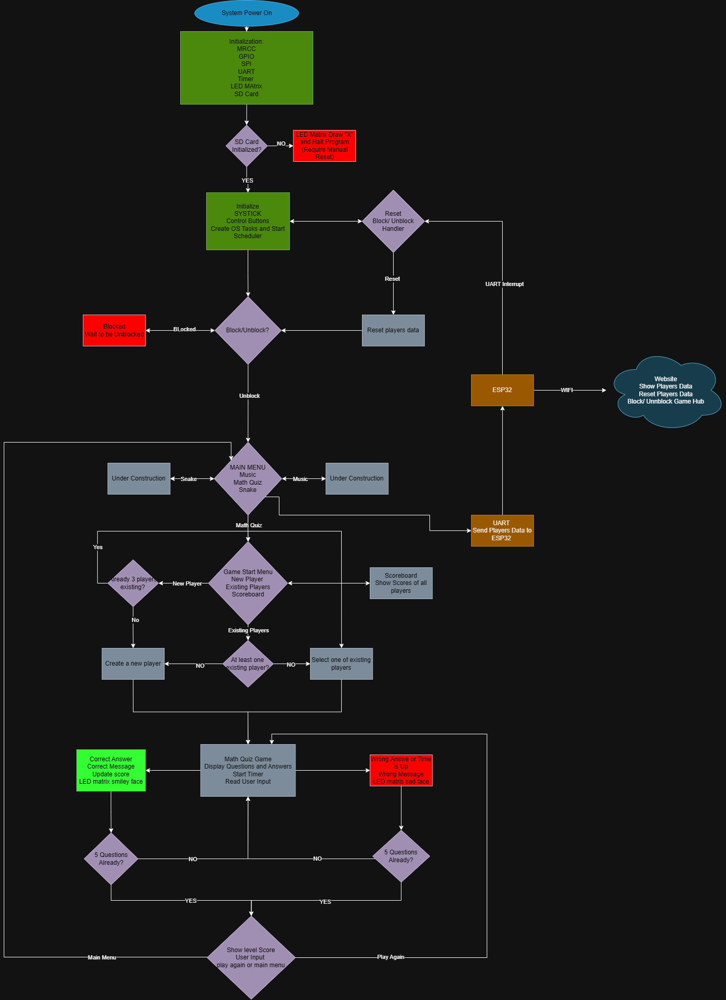

# Interactive Gaming Hub for Children 🎮

The Interactive Gaming Hub is an embedded system designed to provide educational and entertaining games for children.
The system is built around an STM32 microcontroller and features a graphical menu, game logic, visual feedback, persistent storage, and connectivity support.

The main objective of the project is to demonstrate a scalable embedded gaming platform rather than a single standalone game.

## System Features
-Graphical menu displayed on a TFT screen

-Educational Math Quiz game

-Question timer and scoring system

-Score and graphics storage using SD card

-LED matrix visual feedback

-Wi-Fi connectivity for score reporting and parental control

-Modular software architecture (MCAL / HAL / APP)

## Hardware Architecture
The system is centered around an STM32 microcontroller which interfaces with multiple peripherals:

-TFT Display (SPI) – User interface and game display

-Push Buttons (GPIO) – User input

-LED Matrix (GPIO, STP and Timer) – Visual feedback

-SD Card Module (SPI) – Score and graphics storage

-ESP32 Wi-Fi Module (UART) – Connectivity

The STM32 acts as the main controller coordinating all peripherals.

## Software Architecture
The firmware is structured using a layered approach:

# MCAL (Microcontroller Abstraction Layer)
-MRCC

-SYSTICK

-GPIO

-SPI

-UART

-Timers

# HAL (Hardware Abstraction Layer)

-TFT display driver

-LED matrix and STP driver

-SD card driver

-Button handling module

# APP Layer

-System initialization

-RTOS 

-Menu system

-Game state management

-Math Quiz game logic

-Score handling

-WIFI and connectivity handling

This structure improves readability, maintainability, and scalability.

# Application Flow
The following flowchart illustrates the overall system behavior of the Interactive Gaming Hub,
including initialization, game selection, player management, Wi-Fi control, and game execution flow.

# Math Quiz Game
The Math Quiz is an educational game designed to test basic arithmetic skills.

Features:

-Random questions and answers generation

-Timer for each question

-5 Questions per level

-Score calculation based on correctness

-LED Matrix feedback

-End-of-game summary screen

-Multiple players

-Scoreboard

This game demonstrates timing control, user interaction, display management, and data storage.

# Storage and Connectivity
# SD Card

The SD card is used to store game scores and game graphics.

# Wi-Fi

Wi-Fi connectivity is used to send the final game score after completion as well as allow parental control over the game hub. They can reset game pkayers and Block/Unblock the games remotely.
This demonstrates external communication and IoT capability while keeping the implementation simple and reliable.
Website can be accessed at: http://gamehubtest.atwebpages.com/
